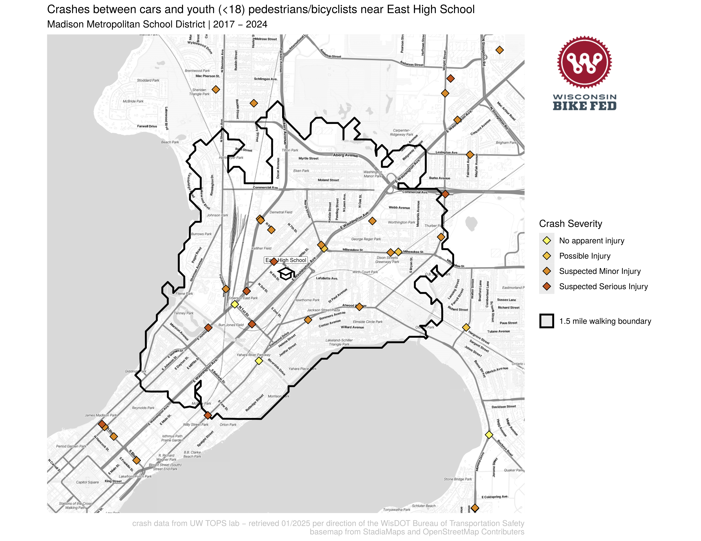

This is a series of RMarkdown files that generates maps of crashes between motor vehicles and bikers and pedestrians in Wisconsin.

## Data sources
- The crash data is from the UW TOPS lab: https://topslab.wisc.edu/
- School location data is from the Wisconsin DPI: https://data-wi-dpi.opendata.arcgis.com/
- County data is from the US census
- Basemaps are from StadiaMaps: https://stadiamaps.com/

## Example figures
### A map of crashes near East High School in Madison, WI:

## To process data and generate figures

- Pre Process TOPS data `make TOPS_data_process`: This combines TOPS data exports from different years and reformats the data.
- OpenStreetMap Routing Machine `make osrm`: this downloads the most recent OpenStreetMap data for Wisconsin, and starts docker containers to run the OpenStreetMap Routing Machine to calculate IsoDistances.
- School Crash Maps `make schoolpdfs`: generates summary csv files that summarize the crash data for a given municipality and county by age, sex, race. This script pulls in the TOPS data from a folder of csv’s that you’ve downloaded from the data retrieval tool. I recommend downloading the whole state and filtering the data with the script. You can edit the variables: municipality_focus, county_focus to adjust what city you're looking at. Line 50

## R Scripts
I'm working to move these to RMarkdown files
- City maps - generates maps for cities in Wisconsin where pedestrian fatalities occur This script pulls in the TOPS data from a folder of csv’s that you’ve downloaded from the data retrieval tool. It also needs access to an API key for StadiaMaps to download all the basemap tiles. You can specify the cities by changing the focus parameters at line ~80
- School Crash maps - generates maps of all the schools in Wisconsin and where cars are hitting kids This script pulls in the TOPS data from a folder of csv’s that you’ve downloaded from the data retrieval tool. It also draws the walk boundary around each school, this is done with a OpenStreetMap routing engine that is running in a docker container. It also needs access to an API key for StadiaMaps to download all the basemap tiles. It took my computer 12 hours to generate all the maps for the state. The script that ends “parallel” runs it in parallel to speed this up. Use that script for bulk map generation, use the other one for generating the maps of a couple school districts. You can change what districts or counties or school types you are generating maps for by editing the variables at line 116 or so.
- Dynamic Map: This takes the TOPS data and generates a dynamic map to host